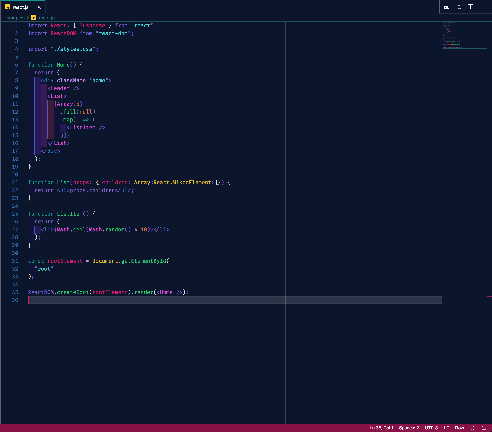
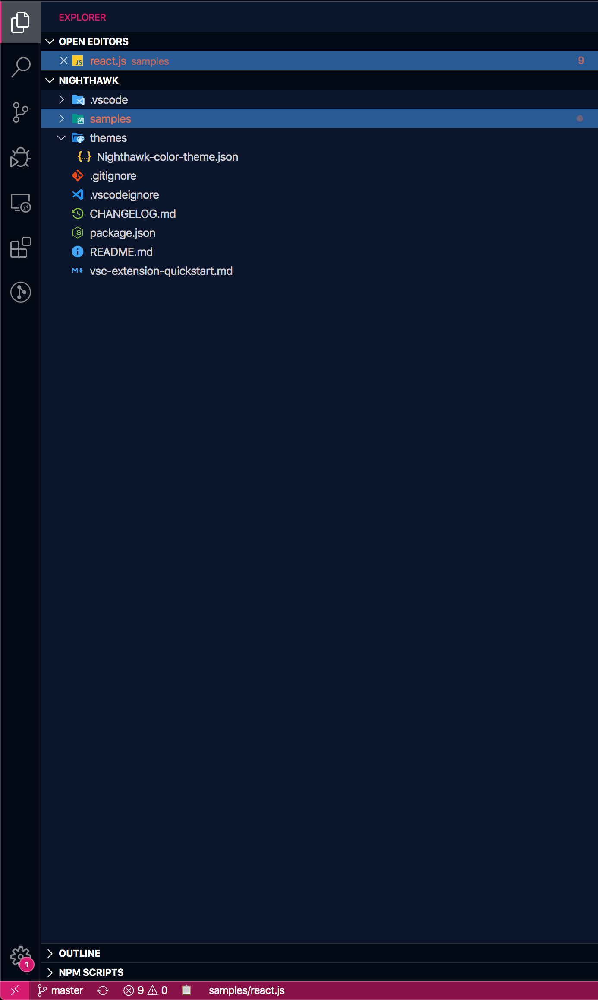
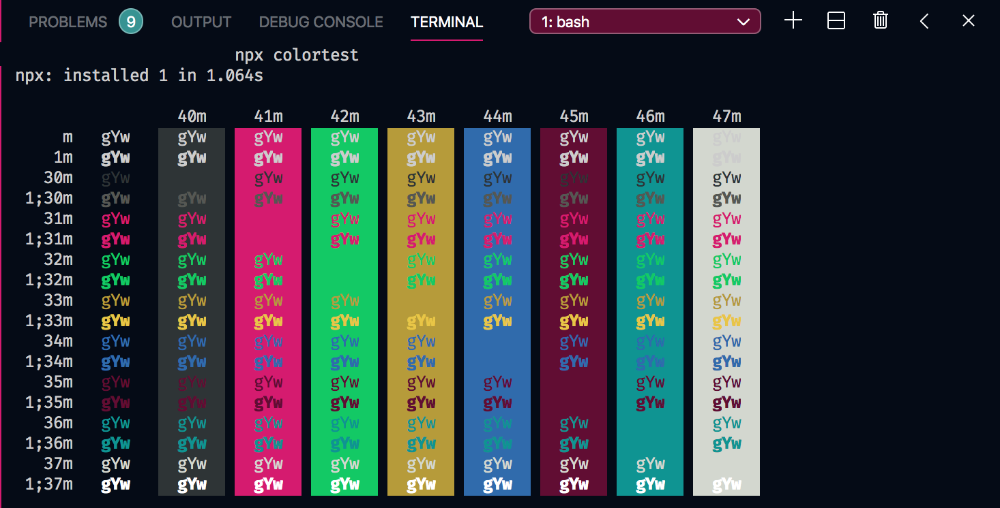

# Nighthawk 

A synthwave inspired dark VS Code theme. Leaning to the side of higher contrast and more accentuated borders and shadows. Into the dark 🌃🌑

## Screenshots

## Installation

1.  Launch VS Code extensions menu
2.  Search for **_Nighthawk_**
3.  Install and Reload
4.  On the bottom left click: ⚙️ > Color Themes > _Nighthawk_
